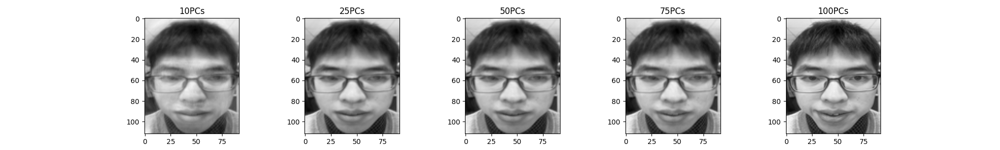

# HW2 Eigenface实验报告
### 实验环境
- cv2
- numpy
- matplotlib

### 实验介绍
- 实验数据集 att_faces 文件，其中增加了自己的10张人脸照片，存在att-face/s0文件夹中
- 总共有41个人，每个人有10张脸的112*92大小的灰度图
构建一个人脸库（至少40人，必须要含有自己的人脸图像），将一半的数据进行训练，一半的数据作为测试，通过PCA方法寻找特征脸，并完成训练、测试、重构的过程，主要包含三个实验结果
1. 平均人脸与至少前10个特征脸；
2. 自己人脸图像的10个PCs、25个PCs、50个PCs、以及100个PCs重构的结果；
3. AT&T人脸库每人的一半数据做训练，另一半做测试，展示随着PC增加，Rank-1识别率的变化曲线（即横坐标为使用的PC的数量、纵坐标为Rank-1 rate的一条曲线）

####   主函数

- loadImg(file_dir,energy):读取程序，利用flatten()完成对灰度图读取后的展平操作，利用energy决定取多少个特征脸，并返回特征脸结果
- classify(path_to_img, i):根据PCA结果对测试程序进行分类，将其归属到某个人脸类别中，其中
i表示选择的特征脸数目
- construct(j):完成第j张脸的重构

####   训练过程——特征脸计算
- 利用np.mean()求每个脸矩阵的平均值得到平均脸
- 利用$X^T*X$的方法简化协方差矩阵来简化运算
- 用np.linalg.eig(A)计算协方差矩阵的特征值

####   人脸识别过程

- 根据输入的人脸图像变换到特征脸空间，计算与训练集中特征脸的欧氏距离，返回最相似的特征脸线性表示，利用其标注值完成识别

####   重构过程

- 特征脸归一化
- 对输入人脸进行线性变换然后利用变换后的结果重构回原来的人脸图像

### 实验结果

#### 平均脸 

#### 前10个特征脸

#### 自己人脸图像的重构
10个PCs、25个PCs、50个PCs、75个PCs以及100个PCs的重构结果

### rank1识别率曲线

用余下测试集训练识别准确度，横坐标为特征脸的数量PCs，纵坐标表示Rank-1的变化情况，可以看到特征值大的特征脸对于识别来说效果比较好，在一开始增加PCs的过程中识别率上升迅速，之后能够保持稳定

